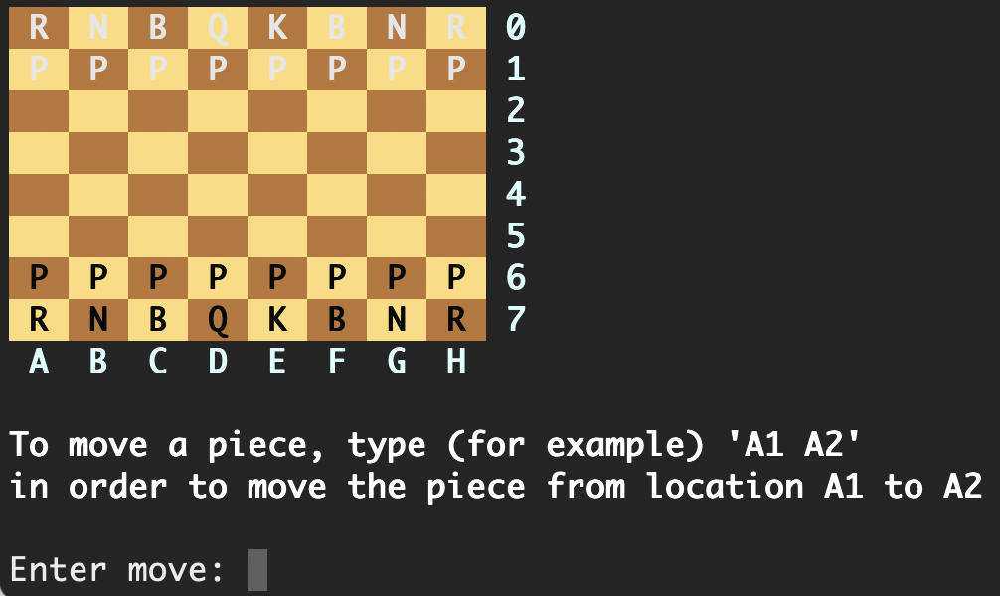

# About

Implementation of a command-line chess game with basic AI functionality built using c. This was originally created as part of a group project with two other members in 2019.



# Installation

Run the following command to build all the necessary files and executables:
```
make
```

# Playing the game

## Main game
To play the game, run the following command:
```
./chess
```
Two optional flags are available:
- -ai: play chess against the AI
- -c: run with a remote client on a separate machine

Notes: 
- Running `chess` without any flags allows for for two players to play chess against one another, without AI of course.
- Both the -ai and -c flags can be used at the same time to allow a remote client to play against our AI.

## Remote client

A remote client was implemented in case a separate AI chess program, developed by a different team, wanted to play against ours. Ultimately though, this was never used against one, and the remote client remained as a way to connect a secondary machine (or two different terminal windows) to the main chess game.

To run the chess game with two different machines, run `./chess` on the first machine then run `./client` on the second. If successful, both the server and client will be connected through a socket.

